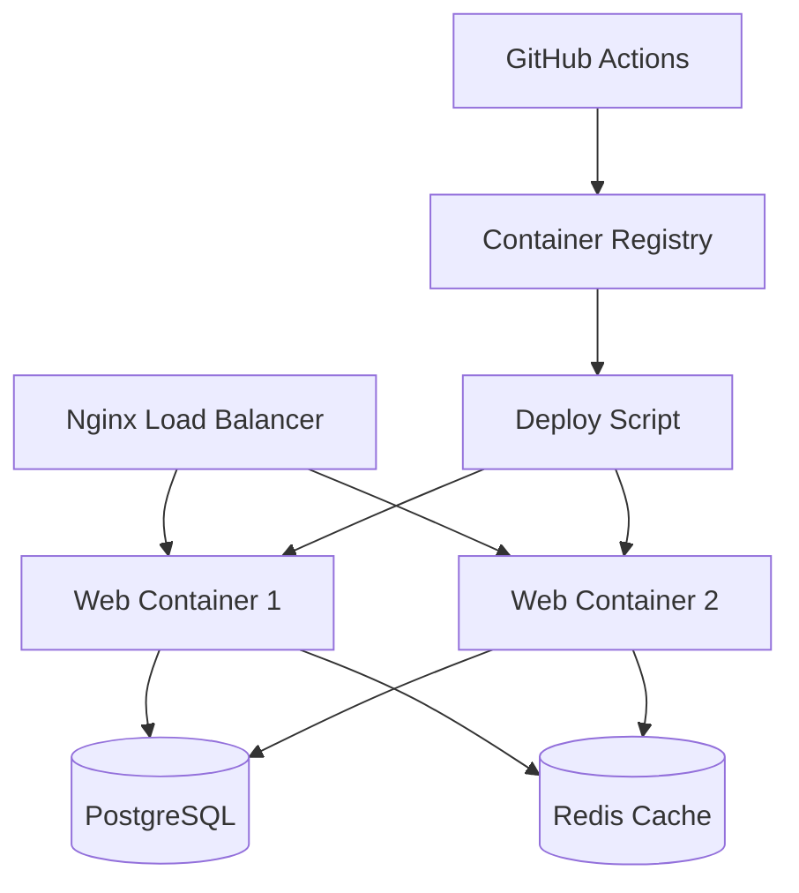

# 🚀 Zero Downtime Deployment Guide

## Visão Geral

Este guia documenta o fluxo completo de deployment com zero downtime para o Sistema de Produtos. A estratégia implementada garante atualizações sem interrupção do serviço através de:

- **Build Multi-stage**: Otimizado para produção
- **Health Checks**: Monitoramento de saúde dos containers
- **Rolling Updates**: Atualização gradual dos serviços
- **Automated Rollback**: Reversão automática em caso de falha
- **Database Migrations**: Execução segura antes do deploy

## 🏗️ Arquitetura de Deploy

### Componentes



### Fluxo de Deploy

1. **Pre-Deploy**:
   - Backup automático do banco
   - Build e tag da nova imagem
   - Push para registry

2. **Deploy Phase**:
   - Run migrations/collectstatic
   - Scale up novos containers
   - Health check dos novos containers
   - Traffic switch via load balancer
   - Scale down containers antigos

3. **Post-Deploy**:
   - Smoke tests
   - Cleanup de imagens antigas
   - Notificações

## 📋 Pré-requisitos

### Servidor de Produção

```bash
# Instalar Docker e Docker Compose
curl -fsSL https://get.docker.com -o get-docker.sh
sh get-docker.sh
sudo usermod -aG docker $USER

# Instalar Docker Compose
sudo curl -L "https://github.com/docker/compose/releases/latest/download/docker-compose-$(uname -s)-$(uname -m)" -o /usr/local/bin/docker-compose
sudo chmod +x /usr/local/bin/docker-compose

# Criar diretórios
sudo mkdir -p /opt/sistema-produtos/{backups,logs,ssl}
sudo chown -R $USER:$USER /opt/sistema-produtos
```

### Configuração Inicial

```bash
# Clonar repositório
git clone https://github.com/z-MaTaS/budgets_project.git /opt/sistema-produtos
cd /opt/sistema-produtos

# Configurar ambiente
cp .env.prod .env
# Editar .env com configurações específicas

# Configurar SSL (se usando HTTPS)
sudo mkdir -p /opt/sistema-produtos/docker/nginx/ssl
# Copiar certificados SSL para o diretório
```

## 🚀 Deploy Inicial

### 1. Primeira Configuração

```bash
# Build inicial
make build

# Deploy inicial
make deploy

# Criar superuser
make create-superuser

# Verificar status
make status
make health
```

### 2. Configuração do Cloudflare

1. **DNS Configuration**:
   ```
   Type: A
   Name: meitans.shop
   Content: [IP_DO_SERVIDOR]
   Proxy: Enabled
   ```

2. **SSL/TLS Settings**:
   - Mode: "Flexible" ou "Full"
   - Edge Certificates: Enabled
   - Always Use HTTPS: Enabled

3. **Speed Settings**:
   - Auto Minify: CSS, JavaScript, HTML
   - Brotli: Enabled
   - Rocket Loader: Enabled

## 🔄 Fluxo de Atualização

### Deploy Automático (Recomendado)

```bash
# Deploy com versão automática
make deploy

# Deploy com versão específica
make deploy APP_VERSION=v1.2.3

# Deploy rápido (sem backup)
make deploy-quick
```

### Deploy Manual

```bash
# 1. Build nova imagem
export APP_VERSION=v1.2.3
make build

# 2. Backup do banco
make backup

# 3. Deploy
./scripts/deploy.sh -v $APP_VERSION

# 4. Verificar saúde
make health
```

### Deploy via CI/CD

O workflow do GitHub Actions executa automaticamente:

```yaml
# Em push para main branch
git push origin main

# Em criação de tag
git tag v1.2.3
git push origin v1.2.3
```

## 🔙 Rollback

### Rollback Rápido

```bash
# Listar versões disponíveis
make list-versions

# Rollback para versão específica
make rollback VERSION=v1.2.2

# Ou usando script direto
./scripts/rollback.sh v1.2.2
```

### Rollback Automático

O script de deploy inclui rollback automático em caso de:
- Health check falhar após 5 minutos
- Smoke tests falharem
- Containers não iniciarem

## 🏥 Health Checks

### Endpoints Disponíveis

- **`/healthz/`**: Check completo (DB + Cache)
- **`/readiness/`**: Check de prontidão
- **`/liveness/`**: Check básico de vida

### Monitoramento

```bash
# Status dos containers
make prod-status

# Logs em tempo real
make logs

# Métricas de recursos
make stats

# Health check manual
curl -f http://localhost/healthz/ | jq .
```

## 🗄️ Gerenciamento de Banco

### Backups

```bash
# Backup manual
make backup

# Listar backups
ls -la backups/

# Backup automático (via cron)
0 2 * * * cd /opt/sistema-produtos && make backup
```

### Migrações

```bash
# Executar migrações
make migrate

# Verificar status das migrações
make shell
>>> from django.core.management import execute_from_command_line
>>> execute_from_command_line(['manage.py', 'showmigrations'])
```

### Restore

```bash
# Restaurar backup específico
make restore BACKUP=backup_20250830_140000.sql

# Restore de emergência
./scripts/restore-emergency.sh backup_file.sql
```

## 🔧 Troubleshooting

### Problemas Comuns

#### 1. Containers não ficam saudáveis

```bash
# Verificar logs
make logs

# Verificar health check
docker-compose -f docker-compose.prod.yml exec web curl localhost:8000/healthz/

# Verificar conectividade do banco
docker-compose -f docker-compose.prod.yml exec web python manage.py dbshell
```

#### 2. Nginx não consegue conectar

```bash
# Verificar configuração
docker-compose -f docker-compose.prod.yml exec nginx nginx -t

# Recarregar configuração
docker-compose -f docker-compose.prod.yml exec nginx nginx -s reload

# Verificar upstream
docker-compose -f docker-compose.prod.yml exec nginx wget -qO- http://web:8000/healthz/
```

#### 3. Deploy falha

```bash
# Verificar última imagem
docker images sistema_produtos

# Rollback manual
./scripts/rollback.sh $(docker images sistema_produtos --format "{{.Tag}}" | sed -n '2p')

# Verificar logs do deploy
tail -f /var/log/deploy.log
```

### Comandos de Debug

```bash
# Entrar no container web
make shell

# Verificar variáveis de ambiente
docker-compose -f docker-compose.prod.yml exec web env | grep -E "(DB_|REDIS_|DJANGO_)"

# Verificar conectividade
docker-compose -f docker-compose.prod.yml exec web python -c "
import os
import psycopg2
conn = psycopg2.connect(
    host=os.getenv('DB_HOST'),
    user=os.getenv('DB_USER'),
    password=os.getenv('DB_PASSWORD'),
    database=os.getenv('DB_NAME')
)
print('DB Connection: OK')
"
```

## 📊 Monitoramento

### Métricas Importantes

1. **Application Health**:
   - Response time do `/healthz/`
   - Error rate
   - Memory usage

2. **Database**:
   - Connection pool
   - Query performance
   - Disk usage

3. **Infrastructure**:
   - CPU usage
   - Memory usage
   - Network I/O

### Alertas Recomendados

```bash
# Configurar monitoramento básico via cron
*/5 * * * * curl -f http://localhost/healthz/ || echo "ALERT: Health check failed" | mail admin@meitans.shop
```

## 🔒 Segurança

### Checklist de Segurança

- [ ] Senhas fortes em produção
- [ ] SSL/TLS configurado
- [ ] Firewall configurado
- [ ] Backups criptografados
- [ ] Logs de auditoria habilitados
- [ ] Rate limiting configurado
- [ ] Headers de segurança aplicados

### Hardening

```bash
# Configurar firewall
sudo ufw allow 22/tcp
sudo ufw allow 80/tcp
sudo ufw allow 443/tcp
sudo ufw --force enable

# Configurar fail2ban
sudo apt install fail2ban
sudo systemctl enable fail2ban
```

## 📈 Performance

### Otimizações Implementadas

1. **Application Layer**:
   - Gunicorn workers otimizados
   - Connection pooling
   - Cache com Redis

2. **Database Layer**:
   - Connection pooling
   - Query optimization
   - Proper indexing

3. **Infrastructure Layer**:
   - Nginx proxy cache
   - Gzip compression
   - Static file optimization

### Monitoramento de Performance

```bash
# Verificar response times
curl -w "@curl-format.txt" -o /dev/null -s http://localhost/

# Top processes
make top

# Resource usage
make stats
```

## 📞 Suporte

### Contatos de Emergência

- **DevOps**: devops@meitans.shop
- **Desenvolvimento**: dev@meitans.shop
- **Infraestrutura**: infra@meitans.shop

### Documentação Adicional

- [Django Deployment Checklist](https://docs.djangoproject.com/en/stable/howto/deployment/checklist/)
- [Docker Production Guide](https://docs.docker.com/config/containers/live-restore/)
- [Nginx Configuration Guide](https://nginx.org/en/docs/)

### Logs Importantes

```bash
# Application logs
tail -f logs/app.log

# Nginx access logs
tail -f docker/nginx/logs/access.log

# System logs
journalctl -u docker -f
```

---

**⚠️ Nota Importante**: Sempre teste procedimentos em ambiente de staging antes de aplicar em produção.
